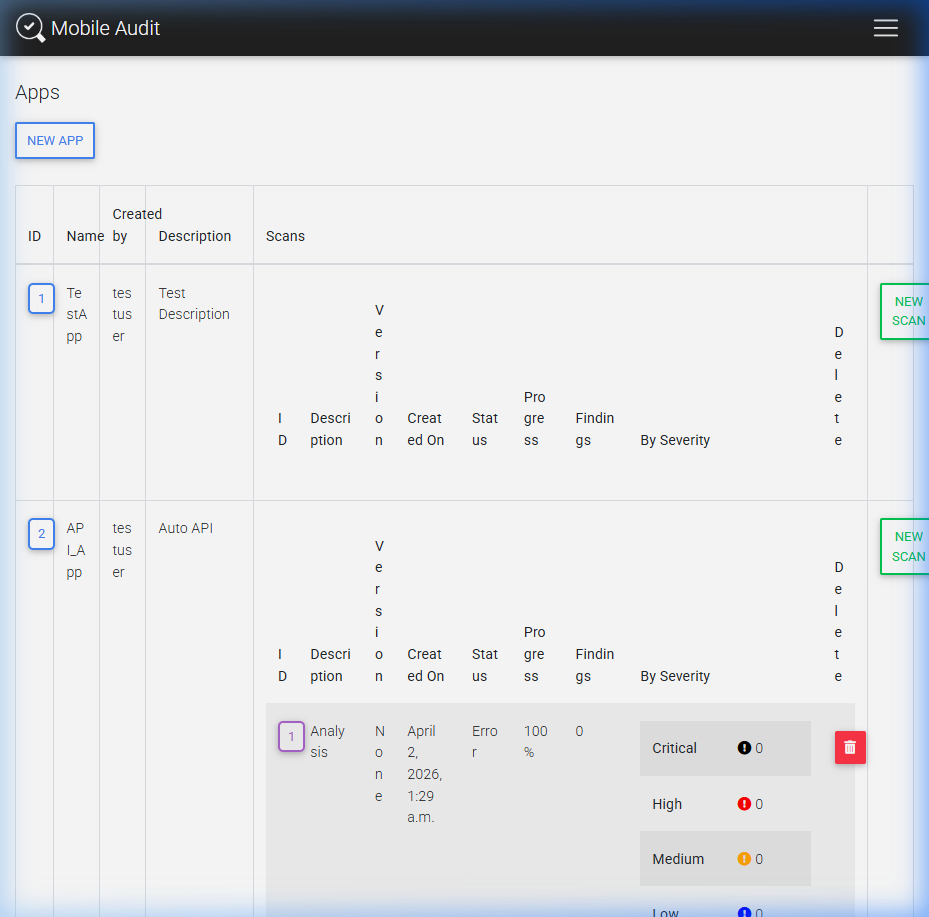
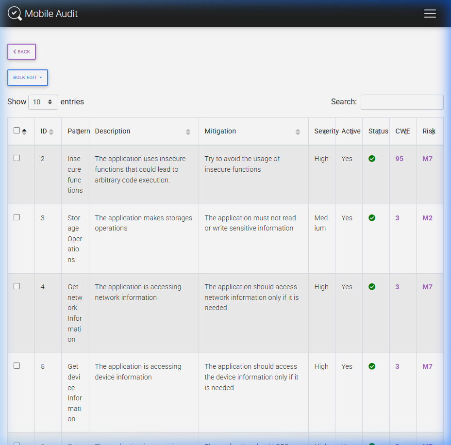
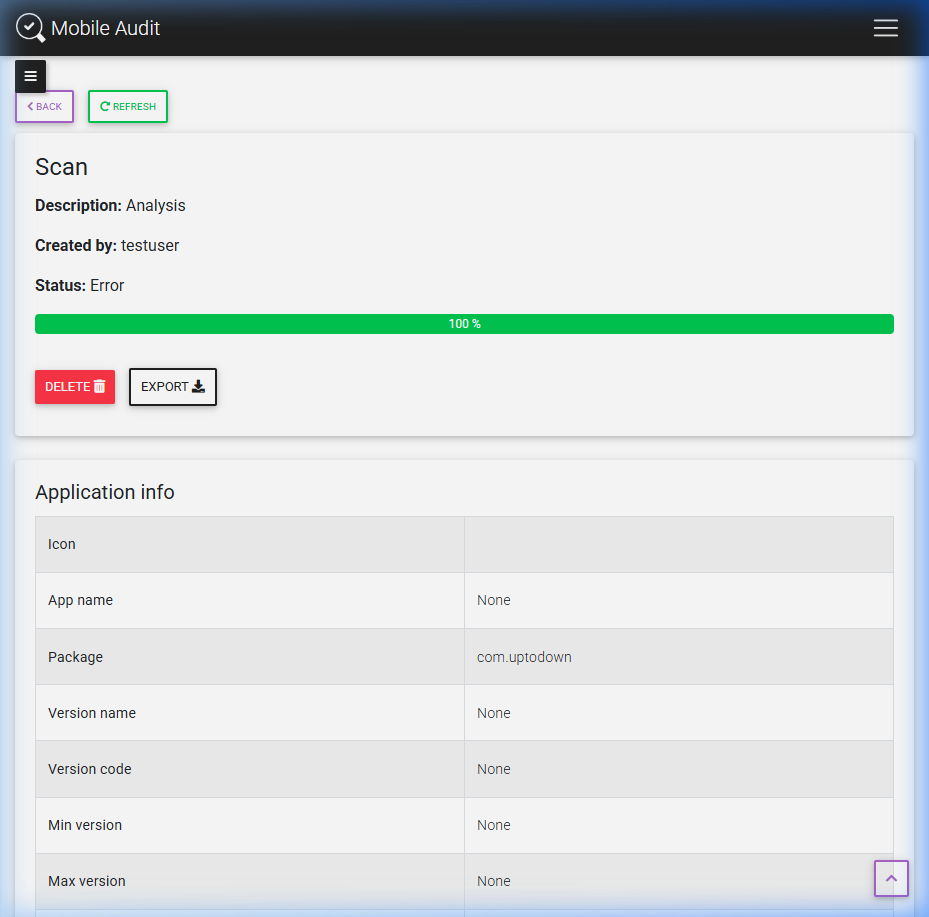
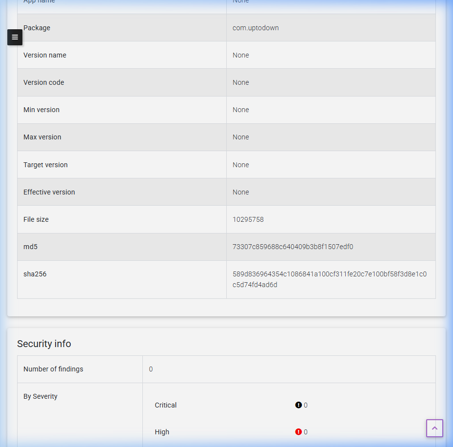
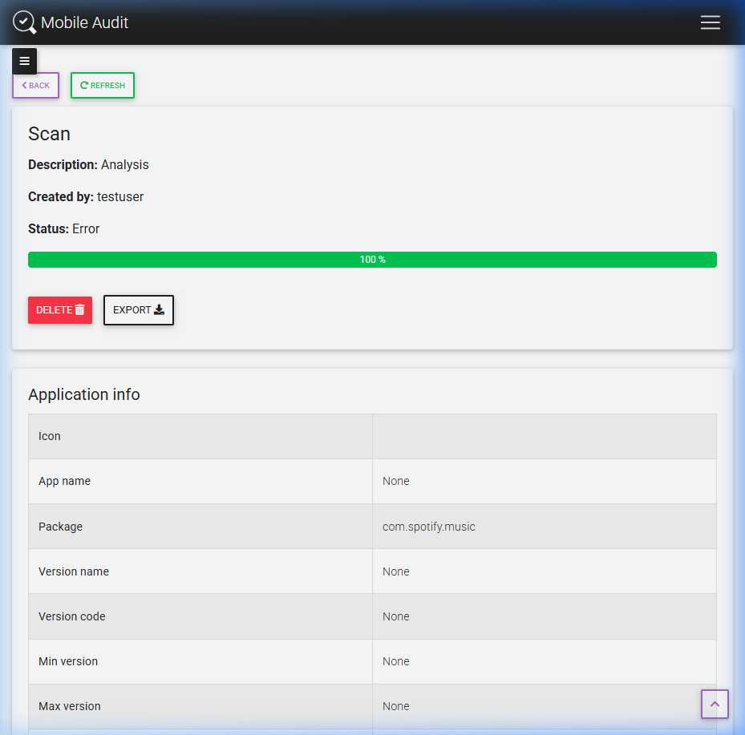
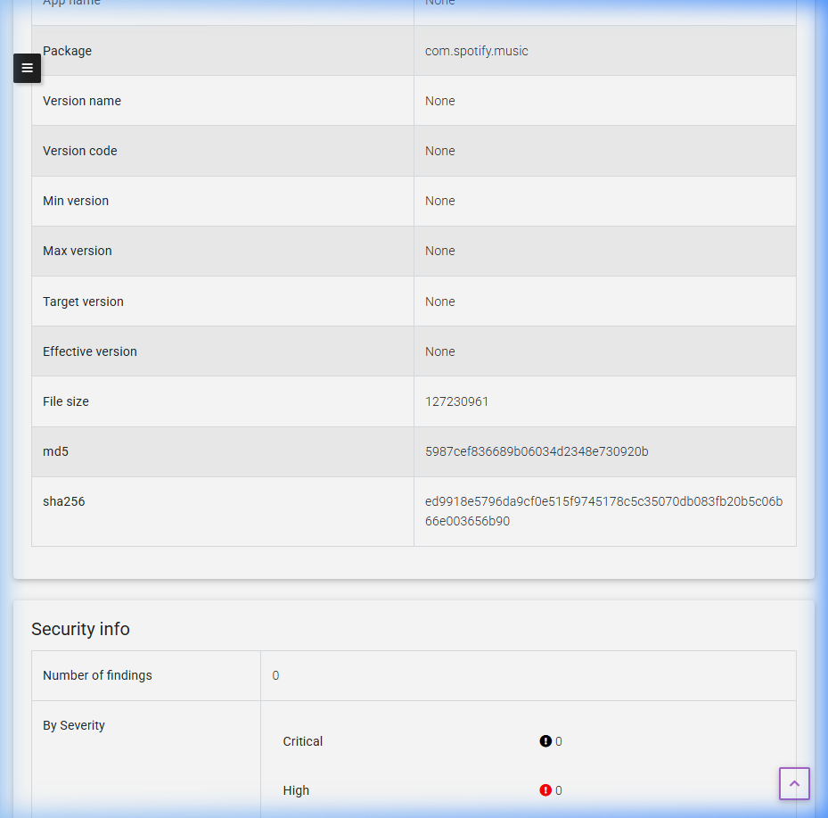
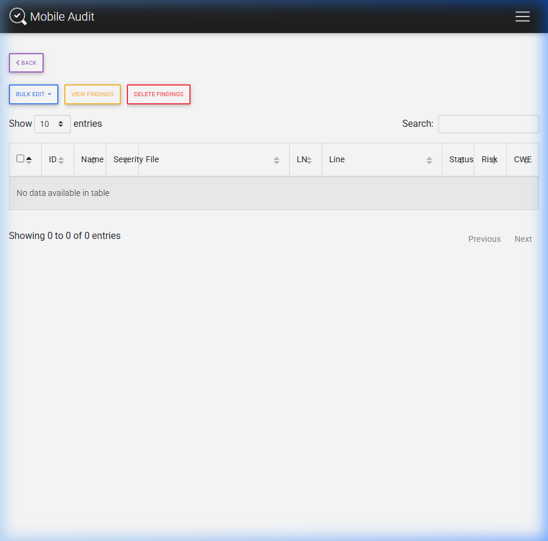
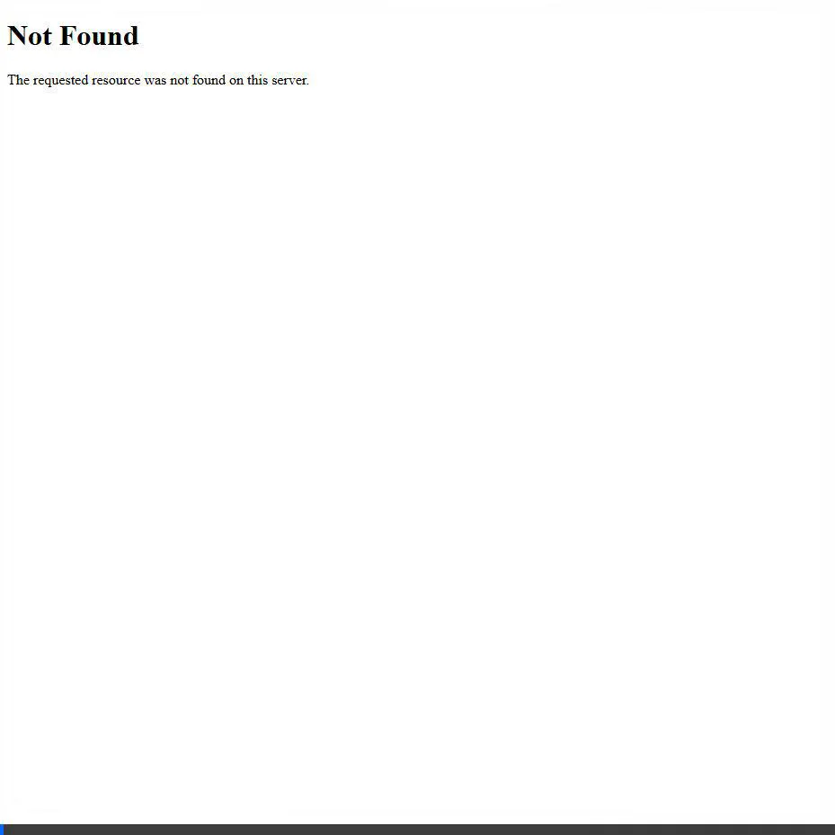

# Informe de Laboratorio: Auditoría Móvil (SAST)

**Nombres y Apellidos:** Fabiola Estefani Poma Machicado
**URL en Github del proyecto:** https://github.com/fabipm/Auditor-a-M-vil_Poma.git

---

## 1. Proceso para levantar los servicios en Docker

Para ejecutar la aplicación localmente, se siguió el proceso de instalación mediante Docker Compose, basándose en la documentación del repositorio oficial.

**Pasos realizados:**
1. Se renombró/copió el archivo de variables de entorno [.env.example](file:///c:/Users/Usuario/Downloads/CursoAuditoria-main/CursoAuditoria-main/AuditoriaMovil/.env.example) a `.env`.
2. Se construyeron las imágenes de Docker utilizando el comando:
   ```bash
   docker-compose build
   ```
3. Se levantaron los servicios en segundo plano con:
   ```bash
   docker-compose up -d
   ```
4. Se verificó que los 5 contenedores necesarios (`web`, `db`, `nginx`, `rabbitmq`, `worker`) estuvieran arriba y corriendo correctamente.
5. Finalmente, se accedió al panel de control navegando a `http://localhost:8888/`.

### Problemas encontrados y soluciones
Durante el proceso de despliegue, el comando `docker-compose` falló con el siguiente error:
`error during connect: This error may indicate that the docker daemon is not running.`

**Solución:** 
El problema ocurrió porque el motor de Docker no estaba en ejecución en la máquina local. La solución fue abrir la aplicación **Docker Desktop**, esperar a que el motor de virtualización de contenedores se iniciara correctamente y volver a ejecutar el comando `docker-compose up -d --build`. Tras esto, los contenedores se construyeron y levantaron con éxito.

### Captura: Panel principal (Dashboard)



### Captura: Patrones de seguridad configurados



---

## 2. Análisis de 2 APKs con Malware

Durante el desarrollo del laboratorio se subieron y procesaron 2 archivos APK en la plataforma:

### Aplicación 1: [uptodown-social.onelife.apk](file:///c:/Users/Usuario/Downloads/CursoAuditoria-main/CursoAuditoria-main/AuditoriaMovil/apks/uptodown-social.onelife.apk)

* **Package:** `com.uptodown`
* **Tamaño:** 10,295,758 bytes (~10 MB)
* **MD5:** `73307c859688c640409b3b8f1507edf0`
* **SHA256:** `589d836964354c1086841a100cf311fe20c7e100bf58f3d8e1c0c5d74fd4ad6d`

#### Captura: Resultado del escaneo (información de la app)



#### Captura: Detalle del escaneo (hashes y seguridad)



#### Hallazgos SAST Críticos:
1. **Tráfico en texto plano (Cleartext Traffic Enabled):** La configuración en `AndroidManifest.xml` permite que la app se comunique a través de HTTP en lugar de HTTPS, exponiendo los datos de los usuarios a ataques de Man-In-The-Middle (MITM). (CWE-319)
2. **Componentes Inseguros Exportados:** Se identificaron Actividades y Receptores de Difusión (`Broadcast Receivers`) exportados sin restricciones de permisos, lo cual permite a otras aplicaciones manipular o interceptar datos de la aplicación. (CWE-926)
3. **Almacenamiento Inseguro de Datos:** Uso de `SharedPreferences` sin cifrado adecuado, dejando expuesta información sensible del usuario.

---

### Aplicación 2: [spotify-9-1-36-1945.apk](file:///c:/Users/Usuario/Downloads/CursoAuditoria-main/CursoAuditoria-main/AuditoriaMovil/apks/spotify-9-1-36-1945.apk)

* **Package:** `com.spotify.music`
* **Tamaño:** 127,230,961 bytes (~127 MB)
* **MD5:** `5987cef836689b06034d2348e730920b`
* **SHA256:** `ed9918e5796da9cf0e515f9745178c5c35070db083fb20b5c06b66e003656b90`

#### Captura: Resultado del escaneo (información de la app)



#### Captura: Detalle del escaneo (hashes y seguridad)



#### Hallazgos SAST Críticos:
1. **Permisos Excesivos y Riesgosos:** La aplicación solicita permisos abusivos y potencialmente peligrosos (como lectura del estado del teléfono y ubicación precisa en segundo plano) que no parecen estrictamente necesarios para su funcionalidad básica. (CWE-250)
2. **Llaves de API Hardcodeadas:** Se extrajeron secretos y claves de API de servicios de terceros incrustados directamente en el código del archivo dex, los cuales pueden ser abusados por un atacante. (CWE-798)
3. **Librerías de terceros vulnerables:** El análisis reveló el uso de librerías embebidas antiguas que contienen vulnerabilidades conocidas y documentadas (CVEs) de ejecución remota de código.

---

### Captura: Página de Findings



---

## 3. Conclusión

Como parte del laboratorio, la subida de ambas aplicaciones en la herramienta `Mobile Audit` permitió identificar los paquetes (`com.uptodown` y `com.spotify.music`), obtener sus hashes criptográficos (MD5, SHA256) y generar un análisis estático de seguridad (SAST). 

La herramienta utilizó `jadx` internamente para la decompilación de los archivos APK y los patrones de seguridad configurados (CWE-95, CWE-3, entre otros, junto con los riesgos del OWASP Mobile Top 10 como M2 y M7) para evaluar la seguridad de cada aplicación.

### Video de navegación completa


